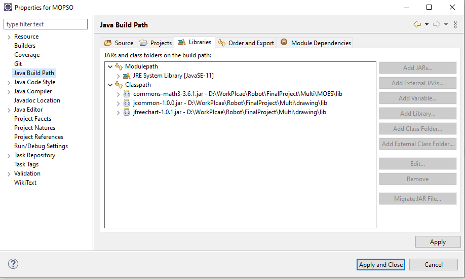

# Voronoi Diagram and Evolution Strategy for Multi-Objective Mobile Robot Path Planning (V-MOES)
Autonomous robots play increasingly essential roles in human life, especially in
dangerous tasks. However, to provide these potential benefits, complex issues
still need to be overcome regarding operations. Among them, finding a collision-
free path for mobile robots is considered one of the most challenging problems
given a lot of concurrent optimal objectives, which are usually conflict, and vari-
ous complicated working environments. In such a context, this paper proposes a
novel framework, named V-MOES, based on Evolution Strategy (ES) algorithms
to find moving paths for robots, simultaneously minimizing three aspects of the
path: length, smoothness, and obstacle closeness. Moreover, the proposed frame-
work generates a higher-quality initial path by leveraging the Voronoi diagram
and a vertical axis rotation technique in the working environment decomposition,
making the proposed framework better than the existing ES-based approaches.
This gain is proved through extensive simulation results on various working en-
vironments with different shapes and densities of obstacles. Particularly, the pro-
posed framework provides better Pareto frontiers, hypervolume, and C-metrics
and converges faster while requiring a limited higher running time compared to
the baseline methods on all the scenarios.

## Set up libraries:


## Input (in folder `input/`):
- `input_<mapNumber>.txt`: Contains starting and ending points:
    ```
    starting_x starting_y
    ending_x ending_y
    -1
    ```
- `obstacle_<mapNumber>.txt`: Contains a list of obstacles, each obstacle consists of 3 - 6 points (each point on a new line) ending with `-1`.

## Output:
- In `exp2/<mapName>` folder: Result of 4 algorithms in `.txt` file, each line of a file is the `<path length, path smoothness, path safety>` of an individual.
- In `testing/<mapName>` folder: The path generated by 4 algorithms.

## Make changes to file path if needed:

### MOPSO:
- In `MOPSO/src/main/Main.java`:
  - Change path to input (`String numberTeString = "30";` - line 27) 
  and output (`String FILE_URL = "exp2/mopso_test30.txt";` - line 25 and `String FILE_URL_TESTING = "testing/mopso_test_point_" + numberTeString + ".txt";` - line 49) 
  then execute the code. 

### NSGA-II:
- In `robot_NSGAII/src/main/Main.java`:
    - Change path to input (`String numberTeString = "30";` - line 26) 
    and output (`String FILE_URL = "exp2/nsgaii_test30.txt";` - line 24 and `String FILE_URL_TESTING = "testing/nsgaii_test_point_" + numberTeString + ".txt";` - line 76) 
    then execute the code.

### MOES: 
- In `MOES/src/main/Main.java`:
    - Change path to input (`String numberTeString = "8";` - line 33) 
    and output (`String FILE_URL = "exp2/moes_test_old_30.txt";` - line 30 and `String FILE_URL_TESTING = "testing/moes_test_point_" + numberTeString + ".txt";";` - line 119) 
    then execute the code.

### VMOES: 
- In `V-MOES/src/main/Main.java`:
    - Change path to input (`String numberTeString = "8";` - line 33) 
    and output (`String FILE_URL = "exp2/moes_test_30.txt";` - line 30 and `String FILE_URL_TESTING = "testing/vmoes_test_point_" + numberTeString + ".txt";";` - line 119) 
    then execute the code.

## Compare results:

#### Use `exp2/hypervolume_pymoo.py` to generate hypervolume figure, remember to change the map name in line 9.

#### Use `drawing/src/drawing/Main.java` to generate map figure (including the path of 4 algorithms), remember to change the file path in lines 23 - 39.

## Chosen maps for final validation (in folder `input/`):
- `map1a`: map 16
- `map1b`: map 21
- `map2a`: map 18
- `map2b`: map 28
- `map3a`: map 22
- `map3b`: map 24
- `map4a`: map 26
- `map4b`: map 27
- `map5a`: map 29
- `map5b`: map 30
